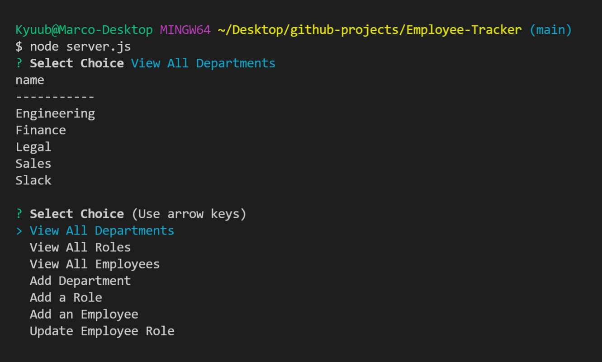

# Employee-Tracker
[](https://opensource.org/licenses/BSD-3-Clause)

## Description

The motiviation behind this project was to create an application that would be able to log and edit an employee database.


## Table of Contents

- [Installation](#installation)
- [Usage](#usage)
- [Credits](#credits)
- [License](#license)

## Installation

Go to github, and git clone this project. Run npm i in the command line to download necessary files. Run npm i to install the packages. Use mysql to get the schema and database.

## Usage




## Credits

Chris Muto: https://github.com/chrismuto/ 
<br>
David Luu: https://github.com/MaestroLuu


```
mysql
inquirer
node.js
vscode
github
```

## License

BSD3

---

## Features

The project is ran on the command prompt with ```node server.js```.

## How to Contribute

This project is not open to contributions from third parties.

## Tests

https://watch.screencastify.com/v/EJJ55aXrd2U8irPAeFI7

## Future Ideas

Would like to get rid of text input and only use arrays in the future.

## Creator Information

https://github.com/JaggedComet

MarcoFlores1029@gmail.com